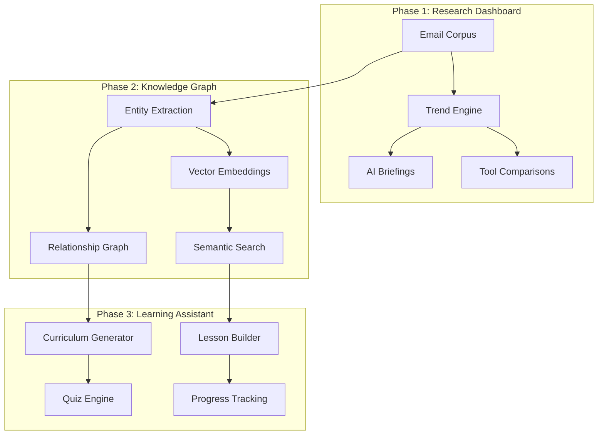

# AI Knowledge Base: Unified Implementation Plan

## Overview

A **three-phase implementation** combining Research Dashboard, Knowledge Graph, and Learning Assistant into a comprehensive AI knowledge platform. Python-based, Replit-deployable.

**Timeline**: 6-8 weeks total | **Stack**: Python (Flask/FastAPI) + SQLite + Modern Frontend

---

## Architecture Overview



---

## Phase 1: Research Dashboard (Weeks 1-2)

> **Goal**: Transform raw emails into actionable intelligence with AI-powered briefings and trend analysis.

### 1.1 Backend Infrastructure

| Component | File | Description |
|-----------|------|-------------|
| Analytics Engine | `services/analytics.py` | Topic clustering, trend detection |
| Briefing Generator | `services/briefings.py` | AI-generated daily/weekly summaries |
| Tool Tracker | `services/tools.py` | Extract & track tool mentions |
| API Routes | `routes/dashboard.py` | REST endpoints for frontend |

### 1.2 Data Processing Pipeline

```python
# New email processing flow
Email → Enhanced Parser → Entity Detection → Analytics DB → Trend Analysis
                                          ↓
                              Tool Mentions → Sentiment Scoring
```

**Key additions to `parse_mbox.py`**:
- Extract tool/product names (Claude, Cursor, Lovable, etc.)
- Detect sentiment (positive/negative/neutral)
- Parse dates for temporal analysis
- Store in SQLite (upgrade from JSON)

### 1.3 New UI Components

| Component | Description |
|-----------|-------------|
| **Executive Briefing** | AI-generated digest (daily/weekly) |
| **Trend Charts** | Interactive topic popularity over time |
| **Tool Matrix** | Compare tools by mentions, sentiment, recency |
| **"What's Hot"** | Real-time trending topics |
| **Smart Filters** | Filter by date range, sentiment, source |

### 1.4 Deliverables

- [ ] SQLite database schema + migration script
- [ ] Analytics service with trend detection
- [ ] AI briefing generation (scheduled + on-demand)
- [ ] Dashboard UI with charts (Chart.js)
- [ ] Tool comparison matrix
- [ ] REST API for all dashboard data

---

## Phase 2: Knowledge Graph + Semantic Search (Weeks 3-4)

> **Goal**: Enable semantic discovery through entity relationships and AI-powered search.

### 2.1 Entity Extraction System

| Entity Type | Examples | Extraction Method |
|-------------|----------|-------------------|
| **Tools** | Claude Code, Cursor, Lovable | Pattern matching + LLM |
| **Companies** | Anthropic, OpenAI, Google | NER + known list |
| **Concepts** | Vibe Coding, MCP, RAG | Keyword + context |
| **People** | @bentossell, Eric Schmidt | Pattern matching |
| **Resources** | Courses, papers, repos | URL analysis |

### 2.2 Vector Embeddings & Search

```python
# Semantic search architecture
┌─────────────────┐     ┌──────────────────┐     ┌─────────────────┐
│  Email Content  │────▶│  OpenAI Embed    │────▶│  SQLite + Vec   │
│  + Summaries    │     │  text-embedding  │     │  (sqlite-vss)   │
└─────────────────┘     └──────────────────┘     └────────┬────────┘
                                                          │
┌─────────────────┐     ┌──────────────────┐              │
│  Search Results │◀────│  Similarity      │◀─────────────┘
│  + AI Synthesis │     │  Query           │
└─────────────────┘     └──────────────────┘
```

**Replit-compatible approach**: Use `sqlite-vss` extension for vector storage (no external DB needed).

### 2.3 Relationship Mapping

| Relationship | Example |
|--------------|---------|
| `integrates_with` | Claude Code → MCP Servers |
| `competes_with` | Cursor ↔ Windsurf |
| `built_by` | Claude → Anthropic |
| `mentioned_with` | Vibe Coding → No-Code |

### 2.4 New UI Components

| Component | Description |
|-----------|-------------|
| **Semantic Search Bar** | Natural language queries |
| **AI Answer Panel** | Synthesized answers with sources |
| **Entity Cards** | Click any tool/concept for deep dive |
| **Relationship Explorer** | Visual connections (D3.js network) |
| **"Related Topics"** | Auto-suggested based on current view |

### 2.5 Deliverables

- [ ] Entity extraction pipeline
- [ ] Vector embedding generation + storage
- [ ] Semantic search API
- [ ] AI synthesis for search results
- [ ] Entity relationship mapping
- [ ] Interactive graph visualization
- [ ] Entity detail pages

---

## Phase 3: AI Learning Assistant (Weeks 5-7)

> **Goal**: Transform knowledge into structured learning experiences with personalization.

### 3.1 Curriculum Generation

```python
# Auto-generated curriculum structure
Curriculum
├── Module: "AI Coding Fundamentals"
│   ├── Lesson 1: Introduction to AI IDEs
│   ├── Lesson 2: Understanding Agents
│   ├── Lesson 3: Prompt Engineering Basics
│   └── Quiz: Fundamentals Assessment
├── Module: "Claude Mastery"
│   ├── Lesson 1: CLAUDE.md Configuration
│   ├── Lesson 2: Context Management
│   └── Project: Build Your First Agent
└── Module: "Advanced Topics"
    └── ...
```

**Generation process**:
1. Cluster emails by topic (existing Phase 1 data)
2. Identify prerequisite relationships (Phase 2 graph)
3. Use LLM to structure into lessons
4. Extract key quotes/examples from source emails

### 3.2 User Progress System

| Feature | Implementation |
|---------|----------------|
| **User Profiles** | SQLite `users` table (email + hashed password) |
| **Progress Tracking** | `user_progress` table (lesson completions) |
| **Skill Assessment** | Initial quiz to place users |
| **Learning Streaks** | Track consecutive days |

### 3.3 Quiz & Project Engine

```python
# AI quiz generation from email content
Email: "Use CLAUDE.md for persistent context..."
         ↓
Quiz: "What file provides persistent project 
       context in Claude Code?"
       A) .env  B) CLAUDE.md ✓  C) config.json
```

**Project suggestions** generated by LLM based on lesson content.

### 3.4 New UI Components

| Component | Description |
|-----------|-------------|
| **Learning Dashboard** | Current progress, next lessons |
| **Module Browser** | All available learning paths |
| **Lesson Viewer** | Content + source emails + resources |
| **Quiz Interface** | Interactive questions with feedback |
| **Progress Charts** | Skill radar, completion stats |
| **Achievement Badges** | Gamification elements |

### 3.5 Deliverables

- [ ] User authentication (simple email/password)
- [ ] Curriculum generation pipeline
- [ ] Lesson content extraction
- [ ] Quiz generation system
- [ ] Progress tracking database
- [ ] Learning dashboard UI
- [ ] Achievement/gamification system

---

## Technical Stack (Replit-Optimized)

| Layer | Technology | Rationale |
|-------|------------|-----------|
| **Backend** | Flask or FastAPI | Python, simple, Replit-native |
| **Database** | SQLite + sqlite-vss | No external DB, vector search built-in |
| **AI/LLM** | OpenAI API (via Replit integration) | Already configured |
| **Embeddings** | text-embedding-3-small | Cost-effective, good quality |
| **Frontend** | HTML + Tailwind + Alpine.js | No build step, reactive |
| **Charts** | Chart.js or ApexCharts | Lightweight, beautiful |
| **Graphs** | D3.js or Cytoscape.js | Network visualization |

---

## Database Schema

```sql
-- Core tables
CREATE TABLE emails (
    id INTEGER PRIMARY KEY,
    subject TEXT,
    content TEXT,
    date DATETIME,
    sender TEXT,
    summary TEXT,
    embedding BLOB,  -- Vector for semantic search
    sentiment REAL,
    created_at DATETIME DEFAULT CURRENT_TIMESTAMP
);

CREATE TABLE entities (
    id INTEGER PRIMARY KEY,
    name TEXT UNIQUE,
    type TEXT,  -- tool, company, concept, person
    description TEXT,
    first_seen DATETIME,
    mention_count INTEGER DEFAULT 0
);

CREATE TABLE email_entities (
    email_id INTEGER REFERENCES emails(id),
    entity_id INTEGER REFERENCES entities(id),
    sentiment REAL,
    PRIMARY KEY (email_id, entity_id)
);

CREATE TABLE entity_relationships (
    entity_a INTEGER REFERENCES entities(id),
    entity_b INTEGER REFERENCES entities(id),
    relationship TEXT,  -- integrates_with, competes_with, etc.
    strength REAL,
    PRIMARY KEY (entity_a, entity_b, relationship)
);

-- Learning system tables (Phase 3)
CREATE TABLE users (
    id INTEGER PRIMARY KEY,
    email TEXT UNIQUE,
    password_hash TEXT,
    created_at DATETIME DEFAULT CURRENT_TIMESTAMP
);

CREATE TABLE modules (
    id INTEGER PRIMARY KEY,
    title TEXT,
    description TEXT,
    order_index INTEGER,
    prerequisite_id INTEGER REFERENCES modules(id)
);

CREATE TABLE lessons (
    id INTEGER PRIMARY KEY,
    module_id INTEGER REFERENCES modules(id),
    title TEXT,
    content TEXT,
    order_index INTEGER
);

CREATE TABLE user_progress (
    user_id INTEGER REFERENCES users(id),
    lesson_id INTEGER REFERENCES lessons(id),
    completed_at DATETIME,
    quiz_score REAL,
    PRIMARY KEY (user_id, lesson_id)
);
```

---

## File Structure

```
ai-knowledge-base/
├── app.py                    # Main Flask app (enhanced)
├── config.py                 # Configuration settings
├── database.py               # SQLite connection + migrations
│
├── services/
│   ├── analytics.py          # Trend analysis, clustering
│   ├── briefings.py          # AI briefing generation
│   ├── entities.py           # Entity extraction
│   ├── embeddings.py         # Vector embedding generation
│   ├── search.py             # Semantic search
│   ├── curriculum.py         # Learning path generation
│   └── quiz.py               # Quiz generation
│
├── routes/
│   ├── dashboard.py          # Dashboard API endpoints
│   ├── search.py             # Search API endpoints
│   ├── learning.py           # Learning system endpoints
│   └── auth.py               # User authentication
│
├── templates/
│   ├── base.html             # Layout template
│   ├── dashboard.html        # Main dashboard
│   ├── search.html           # Semantic search UI
│   ├── entity.html           # Entity detail page
│   ├── learning/
│   │   ├── home.html         # Learning dashboard
│   │   ├── module.html       # Module view
│   │   ├── lesson.html       # Lesson content
│   │   └── quiz.html         # Quiz interface
│   └── components/
│       ├── briefing.html     # Briefing card
│       ├── trend_chart.html  # Trend visualization
│       └── graph.html        # Knowledge graph
│
├── static/
│   ├── css/
│   ├── js/
│   └── images/
│
├── scripts/
│   ├── migrate_to_sqlite.py  # JSON → SQLite migration
│   ├── generate_embeddings.py
│   ├── extract_entities.py
│   └── build_curriculum.py
│
└── data/
    └── knowledge.db          # SQLite database
```

---

## Implementation Timeline

```
Week 1  ████████░░░░░░░░░░░░░░░░  Phase 1: DB migration, analytics engine
Week 2  ████████████████░░░░░░░░  Phase 1: Briefings, dashboard UI
Week 3  ████████████████████░░░░  Phase 2: Entity extraction, embeddings
Week 4  ████████████████████████  Phase 2: Semantic search, graph viz
Week 5  ████████████████████████  Phase 3: Curriculum generation
Week 6  ████████████████████████  Phase 3: Quiz engine, progress tracking
Week 7  ████████████████████████  Phase 3: Polish, testing, deployment
```

---

## Migration Strategy

To preserve your existing data:

1. **Export current JSON** → SQLite `emails` table
2. **Regenerate embeddings** for all emails (one-time cost ~$2-3)
3. **Extract entities** from existing content
4. **Keep original files** as backup

```bash
# Migration commands (will be scripts)
python scripts/migrate_to_sqlite.py      # JSON → SQLite
python scripts/generate_embeddings.py    # Create vectors
python scripts/extract_entities.py       # Build entity graph
```

---

## API Cost Estimates

| Operation | Model | Est. Cost |
|-----------|-------|-----------|
| Initial embeddings (11.7K emails) | text-embedding-3-small | ~$2-3 |
| Daily briefing | GPT-4o-mini | ~$0.02/day |
| Entity extraction (one-time) | GPT-4o-mini | ~$5-8 |
| Curriculum generation | GPT-4o-mini | ~$3-5 |
| Quiz generation | GPT-4o-mini | ~$2-3 |
| Semantic search (per query) | text-embedding-3-small | ~$0.0001 |

**Monthly ongoing**: ~$1-2 for briefings + minimal search costs

---

## Questions Before Starting

1. **User accounts in Phase 3**: Do you want multi-user support, or single-user (no login)?

2. **Briefing schedule**: Daily, weekly, or on-demand generation?

3. **Entity focus**: Any specific tools/companies to prioritize tracking?

4. **Gamification level**: Full badges/streaks, or simple progress bars?
