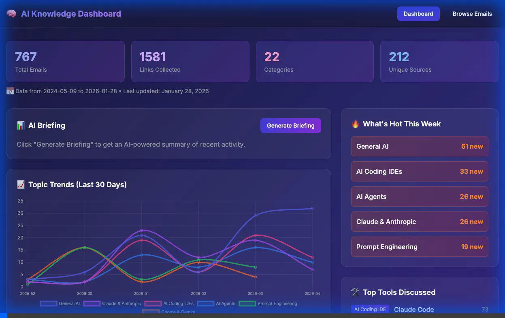
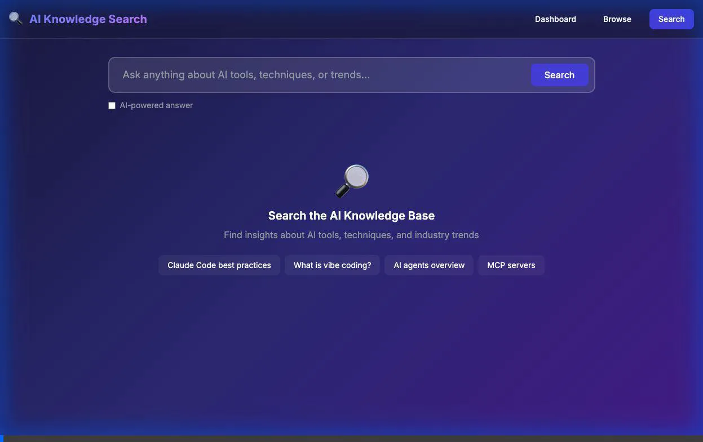
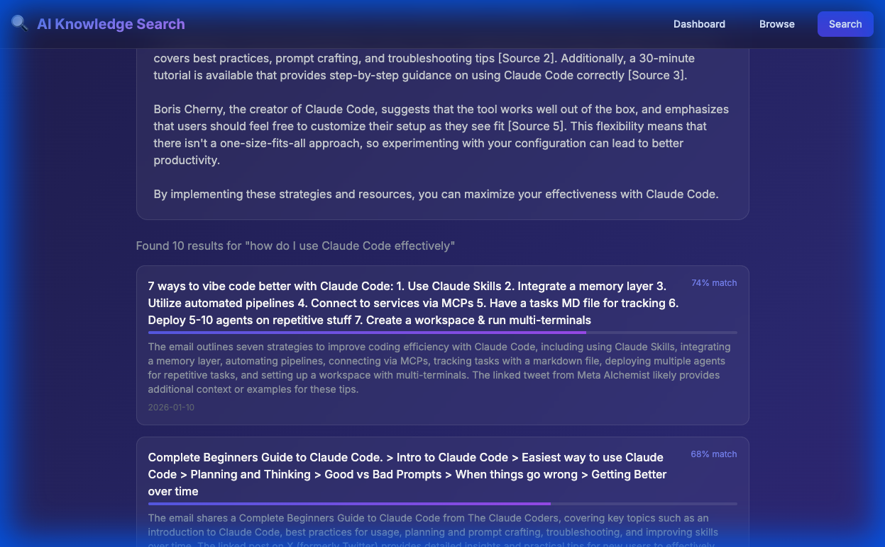

# AI Knowledge Base - Implementation Walkthrough

## Demo Recordings

````carousel

<!-- slide -->

````

## Semantic Search Results



## Verification Results ✅

| Endpoint | Status | Result |
|----------|--------|--------|
| `/health` | ✅ | Server running |
| `/api/stats` | ✅ | 767 emails, 1581 links |
| `/api/tools` | ✅ | Claude Code: 73 mentions |
| `/api/trending` | ✅ | AI Visual Tools +1700% |
| `/api/search` | ✅ | **Semantic search working (74% match)** |
| `/api/learn/curriculum` | ✅ | 6 modules, 16 lessons |
| Dashboard UI | ✅ | All sections render correctly |
| Learn UI | ✅ | All 6 modules visible |
| AI Synthesis | ✅ | Generates answers with source citations |

---

## Summary

Successfully implemented the AI Knowledge Base with all 3 phases:

| Phase | Status | Features |
|-------|--------|----------|
| Phase 1: Research Dashboard | ✅ Complete | Trends, briefings, tool tracking |
| Phase 2: Semantic Search | ✅ Complete | Entity extraction, embeddings, search |
| Phase 3: Learning Assistant | ✅ Complete | 6 modules, 16 lessons, quizzes |

---

## Files Created

### Services (`/services/`)
- `analytics.py` - Trend detection, category stats, what's hot
- `tools.py` - Tool/product tracking with 30+ patterns
- `briefings.py` - AI-powered briefing generator
- `entities.py` - Entity extraction (LLM + pattern matching)
- `embeddings.py` - OpenAI embeddings + cosine similarity search
- `search.py` - Hybrid search with AI synthesis
- `curriculum.py` - 6 learning modules, lesson generation
- `quiz.py` - Quiz generation and grading

### Routes (`/routes/`)
- `dashboard.py` - Dashboard API endpoints
- `search.py` - Search API endpoints
- `learning.py` - Learning API endpoints

### Templates (`/templates/`)
- `dashboard.html` - Research dashboard with charts
- `search.html` - Semantic search with AI answers
- `learn.html` - Interactive learning modules

### Core Files
- `app.py` - Enhanced Flask app with all blueprints
- `database.py` - SQLite schema (15 tables)
- `requirements.txt` - Python dependencies

---

## Data Summary

```
Emails: 767
Links: 1,581
Categories: 22
Entities: 38
Tools tracked: 26
Curriculum modules: 6
Lessons: 16
```

### Top Tools Discussed
1. Claude Code (73 mentions)
2. Google (72 mentions)
3. Claude (64 mentions)
4. Gemini (43 mentions)
5. OpenAI (38 mentions)

### Top Categories
1. General AI (204)
2. AI Coding IDEs (169)
3. AI Agents (144)
4. Claude & Anthropic (133)
5. AI Visual Tools (101)

---

## Running Locally

```bash
cd ai-knowledge-base

# Install dependencies
pip install -r requirements.txt

# Initialize database (if needed)
python database.py
python scripts/migrate_to_sqlite.py

# Run app
python app.py
# → http://localhost:8080
```

## Deploying to Replit

1. Upload project files
2. Set secret: `OPENAI_API_KEY`
3. Run: `python app.py`

> **Note**: Semantic search and AI briefings require OpenAI API credits. Without credits, the app gracefully falls back to keyword search and structured briefings.

---

## Routes Available

| Route | Description |
|-------|-------------|
| `/` | Dashboard home |
| `/browse` | Original email browser |
| `/search` | Semantic search page |
| `/learn` | Learning modules |
| `/api/stats` | JSON stats |
| `/api/trending` | Trending topics |
| `/api/tools` | Tool rankings |
| `/api/search?q=...` | Search API |
| `/api/learn/curriculum` | Curriculum API |
